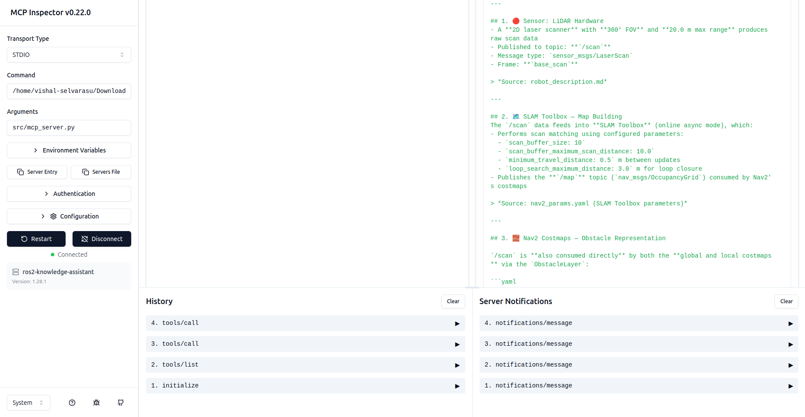
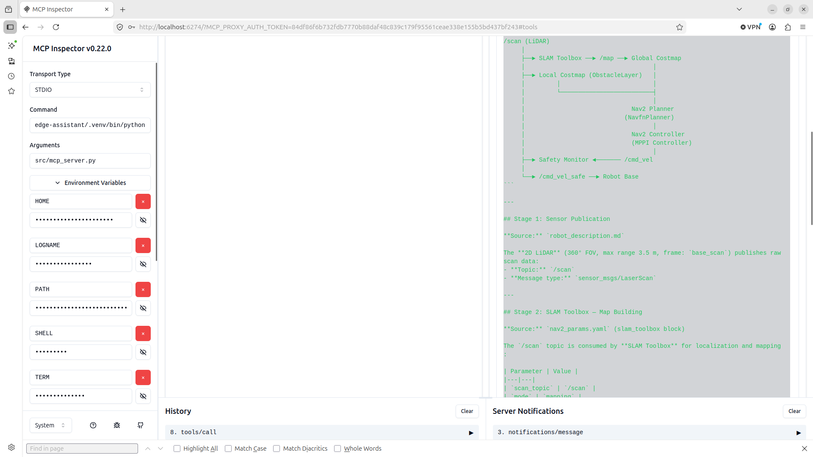
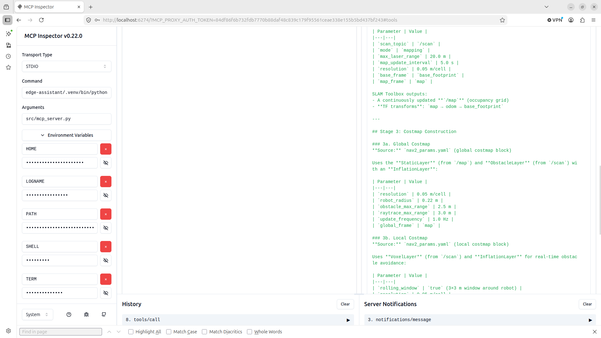
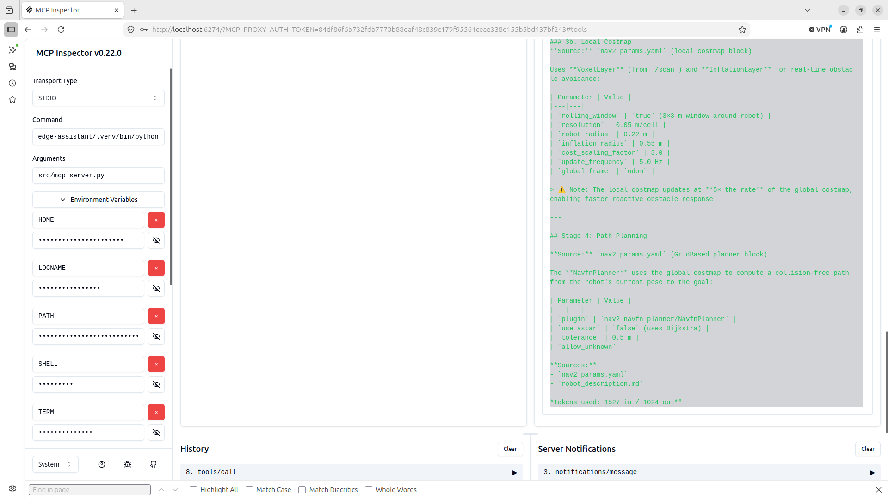
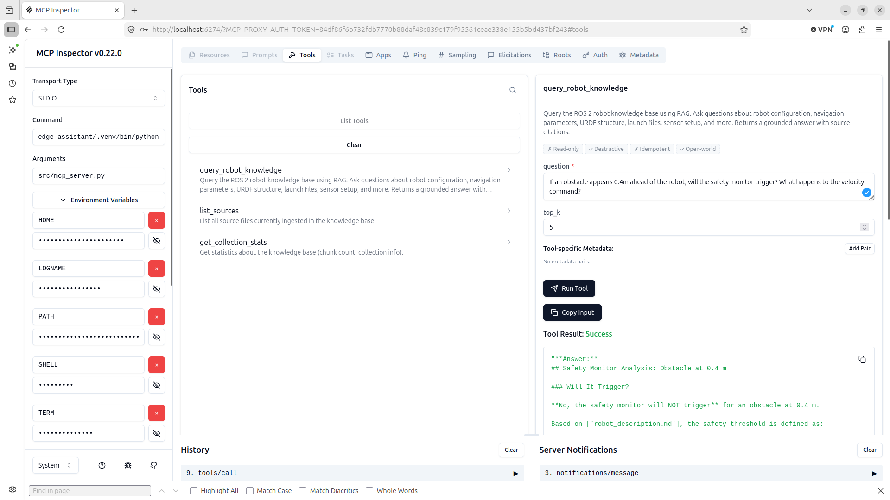
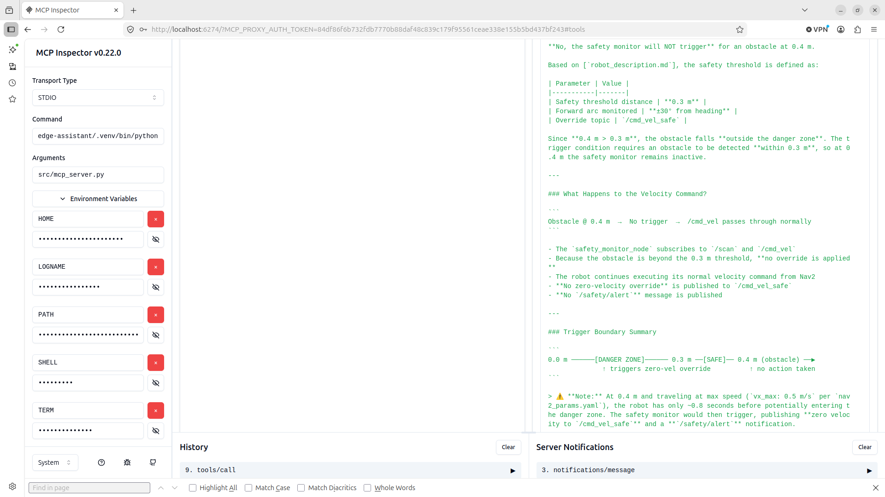
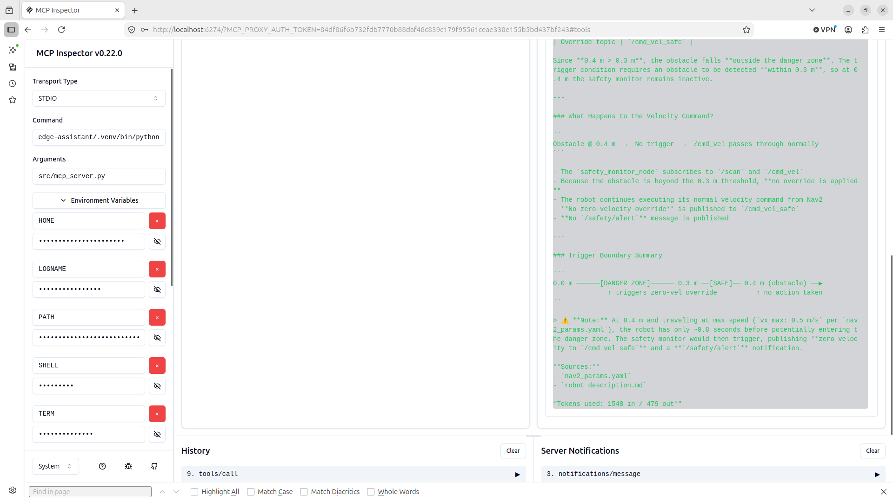

# ROS 2 Robot Knowledge Assistant

Built this because I got tired of grepping through nav2_params.yaml every time I forgot which controller plugin I configured. Now I just ask.

It's a RAG pipeline that ingests your robot's actual files — nav params, URDF, launch configs, READMEs — into a local vector store, and lets you query them in natural language via a FastAPI endpoint or an MCP server that works directly in Claude Desktop.

---

## What it can do

Ask things like:

- *"What is the inflation radius in the local costmap?"*
- *"Explain the full data flow from LiDAR scan to velocity command"*
- *"If an obstacle appears 0.4m ahead, will the safety monitor trigger?"*

And it answers from your actual config files, with source citations.

---

## Demo

### LiDAR → Velocity Command Flow (cross-file reasoning)
Queried via MCP Inspector — answer pulls from both `nav2_params.yaml` and `robot_description.md`:






### Safety Monitor Analysis
Scenario-based reasoning about safety thresholds and velocity override behavior:





---

## Architecture

```
Your robot docs (yaml, md, urdf, py...)
              │
              ▼  ingest.py
       ChromaDB (local)
       all-MiniLM-L6-v2 embeddings
              │
              ▼  retrieve top-k chunks
       Claude Sonnet 4.6
              │
      ┌───────┴────────┐
      ▼                ▼
  MCP Server       FastAPI :8000
  (stdio)          /query /sources /stats
      │                │
  Claude Desktop    curl / browser
  MCP Inspector     any HTTP client
```

---

## Quickstart

```bash
git clone https://github.com/VishalSelvarasu/ros2-knowledge-assistant
cd ros2-knowledge-assistant

python -m venv .venv
source .venv/bin/activate
pip install -r requirements.txt

cp .env.example .env
# Add your ANTHROPIC_API_KEY to .env

Drop your robot docs (`.yaml`, `.md`, `.urdf`, `.py`, `.txt`) into `docs/`, then:

```bash
# Ingest
python src/ingest.py

# Test RAG directly
python src/rag.py "What controller plugin handles path following?"

# Start HTTP API
uvicorn src.api:app --host 0.0.0.0 --port 8000
# → http://localhost:8000/docs
```

---

## MCP Server

Test with MCP Inspector:

```bash
npx @modelcontextprotocol/inspector python src/mcp_server.py
```

Or add to Claude Desktop config (`~/.config/Claude/claude_desktop_config.json` on Linux):

```json
{
  "mcpServers": {
    "ros2-knowledge-assistant": {
      "command": "/absolute/path/to/.venv/bin/python",
      "args": ["/absolute/path/to/src/mcp_server.py"],
      "env": {
        "ANTHROPIC_API_KEY": "sk-ant-...",
        "CHROMA_PATH": "/absolute/path/to/chroma_db"
      }
    }
  }
}
```

Three tools get exposed: `query_robot_knowledge`, `list_sources`, `get_collection_stats`.

---

## HTTP API

```bash
# Query
curl -X POST http://localhost:8000/query \
  -H "Content-Type: application/json" \
  -d '{"question": "What is the robot radius?"}'

# List ingested files
curl http://localhost:8000/sources

# DB stats
curl http://localhost:8000/stats
```

Full interactive docs at `http://localhost:8000/docs`.

---

## Docker

```bash
docker compose build

# Ingest
docker compose --profile ingest up ingest

# Run API
docker compose up api
```

---

## Project Structure

```
ros2-knowledge-assistant/
├── src/
│   ├── ingest.py        # chunks docs → ChromaDB
│   ├── rag.py           # retrieval + Claude generation
│   ├── mcp_server.py    # MCP server (3 tools, stdio)
│   └── api.py           # FastAPI REST interface
├── docs/                # put your robot files here
├── demo/                # screenshots
├── Dockerfile
├── docker-compose.yml
└── requirements.txt
```

---

## Stack

| Layer | Tool |
|-------|------|
| Embeddings | `all-MiniLM-L6-v2` (local, via sentence-transformers) |
| Vector store | ChromaDB (persistent) |
| LLM | Claude Sonnet 4.6 |
| MCP | `mcp` Python SDK (stdio transport) |
| API | FastAPI + Uvicorn |
| Containers | Docker Compose |

---

## Extending

**Add PDF support** — install `pymupdf`, extract text, drop the `.pdf` extension into `SUPPORTED_EXTENSIONS` in `ingest.py`.

**Ingest ROS 2 bag metadata** — parse rosbag2 metadata YAML and topic lists as text chunks. Then you can query past robot runs in natural language.

**Add a chat UI** — a simple Streamlit app calling `/query` would take about 30 lines. The API already handles everything else.

---

## License

MIT
